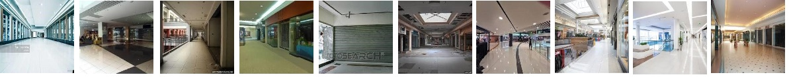

# EVA-Session-14-15A

Dataset Link:

Datasets:
Complete Dataset:
https://drive.google.com/drive/folders/15ZgDJ-4PpYAtNZRkTRlRmXulN6UOoZZq
Dataset 1_80K – 
https://drive.google.com/drive/folders/15ZgDJ-4PpYAtNZRkTRlRmXulN6UOoZZq

Dataset 80K_160K - https://drive.google.com/drive/folders/1WAfa6rctCX6lAG_XXgXyBF8uAXlD6cJw

Dataset 160K_240K - https://drive.google.com/drive/folders/1WAfa6rctCX6lAG_XXgXyBF8uAXlD6cJw

Dataset 240K_320K- 
https://drive.google.com/drive/folders/15ZgDJ-4PpYAtNZRkTRlRmXulN6UOoZZq

Dataset 320K_400K – 
https://drive.google.com/drive/folders/15ZgDJ-4PpYAtNZRkTRlRmXulN6UOoZZq

Depth:
Depthset Part1 – 
 https://drive.google.com/drive/folders/1d_X6jRnQ7vC-CpaM1J0UFbv6I2_ZTTyN

Depthset Part2 - https://drive.google.com/drive/folders/1ooDlcLX7CwpDYVOyW9Abw8hX_70vvfvO

Depthset Part3 – https://drive.google.com/drive/folders/1CroRGYI7FUJt7Lp9jRutNj9vhgi70f-I

Depthset Part4 –
https://drive.google.com/drive/folders/1TsOKE4meT-oV2yb1CSsd12lUUCkOGl9j

Depthset Part5 – 
https://drive.google.com/drive/folders/1o8BsQynEXUu4XpdexLtz2JPaqtDyLmXy

Dataset Statistics:
1.	Kind of Images:
      a.	Foreground (Fg) Images: 100 PNG Images of size less than 148*148.
      b.	Background (Bg) Images: 100 JPEG Images of size 224*224
      c.	Fg_Bg Images: 100*(20*5)*40 JPEG = 400, 000 Images
      Note: (20*5 is Fg images are taken 20 as a set and 5 such sets)
      Foreground Images are Randomly placed in 20 positions on Background and then they are flipped) 
      d.	Masks Images:  100*(20*5)*40 JPEG = 400, 000 Images
      e.	Depth Images: 400,000 Images JPEG

2.	Total Images of Each Kind
      a.	Foreground (Fg) Images: 	    100 
      b.	Background (Bg) Images: 	    100 
      c.	Fg_Bg Images:             		400,000 
      d.	Masks Images:  			          400,000
      e.	Depth Images: 			          400,000 

3.	Total Size of the Dataset: 		      400000 + 400000
4.	Mean and Standard Deviation Values of Fg_Bg and Masks:
      a.	Mean: ['0.306218862533569','0.287717372179031', 0.269325882196426']
      b.	Standard Deviation: ['0.214562639594078', '0.213071450591087', '0.213857620954514']

Dataset Components
1.	Background Images:
   
 
2.	Foreground Images:
   
3.	Foreground Masks:
   
4.	Fg_Bg Images:
   
5.	Depth Images:
   
Dataset Creation:
How were Foreground (fg) created with Transparency?
Using the GIMP Tool, the foreground (fg) images were generated. The process is listed below:
    1.	Open the image
    2.	Add the Transparency Layer i.e., Alpha Channel on it
    3.	Using the Free Select Tool, Select the Image Portion (for which transparent image has to be created)
    4.	Then Select Invert
    5.	Using the Edit Toolbar – clear the Background
    6.	Reset the size of image to the require size using Scale Image
    7.	Export the Image to PNG format (which has 4 channels – along with 3 channels RGB, it has additional Alpha Channel). The alpha channel allows for transparency in an image. Not all image formats support it, but PNG is one of the most commonly used image formats that does.
How were masks created for Foreground (fg) Images?
While generating the transparent foreground images, we can also create the mask for that foreground image. The process is listed below:
    1.	Open the image
    2.	Add the Transparency Layer i.e., Alpha Channel on it
    3.	Using the Free Select Tool, Select the Image Portion (for which transparent image has to be created)
    4.	Then Select Invert
    5.	Using the Edit Toolbar – clear the Background
    6.	Reset the size of image to the require size using Scale Image
    7.	Edit – Fill the background of the image with Black Color 
    8.	Then Select Invert
    9.	Edit – Fill the foreground of the image with white Color 
    10.	Export the Image to PNG format  

How did you overlay the fg over bg and created 20 variants?
To create the Fg over Bg images and also the Fg over Bg mask images, we will place the fg images on top of bg images at random positions, 10 times, and do this with flipped fg images, in total we will have 
(100) BG x (100) FG x flip 2 times (2*20(Randomly placed 10 images plus flips)) = 100 * 100 * 40 = 400,000 images
BgFg + BgFg Masks =  400,000 + 400,000 = 800,000
Implementation Part:
    1.	Creating a directory.
    !mkdir OverlayDir

    2.	Creating subdirectories for BgFg and Masks for it.
    %cd OverlayDir
    !mkdir BgFg
    !mkdir BgFgMask

    3.	Keeping Foreground and flips randomly on Background.
    4.	Keeping Foreground masks and flips of masks randomly on Background.

    path = '/content/gdrive/My Drive/EVA4/fg_bg Images/'
    start1 = 1 #  Choosing numbers of images to be generated
    black = np.zeros((224,224))

    for i in range(1,101): #1 background images – (1 – 100)

            bg = Image.open(f'{path}/BackgroundMall/bg{str(i)}.jpg')

            for j in  range(1,21): #1 foreground image and masks - (1 – 20)
              fg = Image.open(f'{path}/ForegroundPerson/fg{str(j)}.png')
              mask = Image.open(f'{path}/Mask/m{str(j)}.png').convert('1')

            for k in range(1,21): # Placing flips (1 – 20)
                 r1 = random.randint(1, 120)
                 r2 = random.randint(1, 120)
                 bg1 = copy.deepcopy(bg)
                 bg2 = copy.deepcopy(bg)
                 fg1 = copy.deepcopy(fg)
                 m1 = copy.deepcopy(mask)
                 black_img1 = Image.fromarray(black,mode='1')
               black_img2 = Image.fromarray(black,mode='1')

               flipfg = fg1.transpose(PIL.Image.FLIP_LEFT_RIGHT) #flip image
               flipmask = m1.transpose(PIL.Image.FLIP_LEFT_RIGHT) #flip mask
    bg1.paste(fg1,(r1,r2),fg1)
              bg2.paste(flipfg,(r1,r2),flipfg)

              black_img1.paste(m1,(r1,r2), m1)

              black_img2.paste(flipmask,(r1,r2), flipmask)

                   bg1.save(f"/content/OverlayDir/BgFg/bgfg{str(start1)}.jpg",optimize=True, quality=30)
                     black_img1.save(f"/content/OverlayDir/BgFgMask/bgfgmask{str(start1)}.jpg",optimize=True, quality=30)

              start1+=1
                       bg2.save(f"/content/OverlayDir/BgFg/bgfg{str(start1)}.jpg",optimize=True, quality=30)
                   black_img2.save(f"/content/OverlayDir/BgFgMask/bgfgmask{str(start1)}.jpg",optimize=True, quality=30)

            start1+=1
            print(start1)

    5.	Saving into Corresponding Directories and Zip the files.

How did you create your depth images? 
    1.	Cloned the pretrained model from link Ialhashim(shared in the canvas 15A):
    https://github.com/ialhashim/DenseDepth

    2.	We get modules from the pretrained model and run here in colab.
    Modules : 

    a.	From Keras / Tensor Flow loading the model “nyu.h5”.
    b.	From Layers importing Bilinearsamplingup 2D
    c.	Load Images
    d.	Save Images
    e.	Predict function to do predictions.

    # Keras / TensorFlow
    os.environ['TF_CPP_MIN_LOG_LEVEL'] = '5'
    from keras.models import load_model
    from layers import BilinearUpSampling2D
    #from utils import predict, load_images, display_images
    from matplotlib import pyplot as plt

    # Custom object needed for inference and training
    custom_objects = {'BilinearUpSampling2D': BilinearUpSampling2D, 'depth_loss_function': None}

    print('Loading model...')

    # Load model into GPU / CPU
    model = load_model('nyu.h5', custom_objects=custom_objects, compile=False)

    print('\nModel loaded ({0}).'.format("nyu.h5"))

    # Input images
    div = 200
    num = 236801 #Generating sets of images (3200) batchwise(Batch 3)
    for i in range((240000-236800)//div): 

       inputs = load_images(path ="/content/OverlayDir_Sample/BgFg/", start=num,end = num+div )
       print('\nLoaded ({0}) images of size {1}.'.format(inputs.shape[0], inputs.shape[1:]))
    # Compute results
      outputs = predict(model, inputs)
    # Display results
      display_images(outputs.copy(), inputs.copy(), start = num)
               num+=div

    print("done")

    3.	Zipping the Depth files into a separate directory inside DepthModel.

Colab Links:
    1.	Dataset(pynb):https://colab.research.google.com/drive/1gVyUY93azAIvZVuts5Pm1J1WG76rYgoA
    2.	Statistics File (pynb): https://colab.research.google.com/drive/1hCZLKH8f-dheNitM7nw_qz6n605N3KGY#scrollTo=PUnyrvrum-b3
    3.	Depth Creation (pynb) : https://colab.research.google.com/drive/1BvpvWvAAWcUBBtRws20h5am1DiLQsTG3
